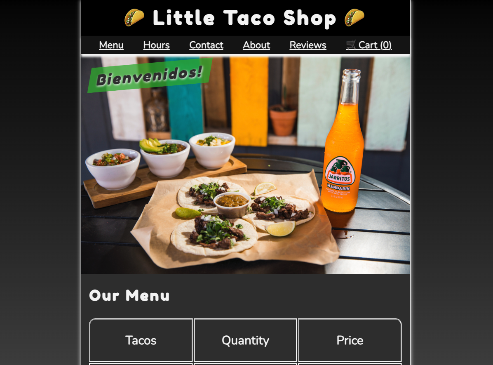

# 🌮 Little Taco Shop — Taco-Restaurant

<p align="center">
  <a href="https://tacorestaurant.netlify.app/" target="_blank">
    
  </a>
</p>

<p align="center">
  <a href="https://tacorestaurant.netlify.app/" target="_blank"><b>Live Demo</b></a>
  ·
  <a href="#-features">Features</a>
  ·
  <a href="#-tech-stack">Tech Stack</a>
  ·
  <a href="#-highlights-for-recruiters">Highlights for Recruiters</a>
  ·
  <a href="#-getting-started">Getting Started</a>
</p>

---

## 📊 Project Breakdown

**HTML 64.6% · CSS 23.4% · JavaScript 12.0%**

Static-first, progressively enhanced UI with a small, focused JS layer for interactivity and persistence.

---

## ✨ Features

* **Cart with persistent state (no backend required):** Uses `localStorage` to store items and updates a dynamic cart badge.
* **Reviews with Supabase:** Users can submit ratings & text reviews, which are displayed immediately on the page.
* **Responsive layout with CSS Grid & Variables:** Scales cleanly from mobile → desktop, dark mode supported via `prefers-color-scheme`.
* **Accessible markup:** Semantic HTML, labeled navigation, keyboard-friendly links, offscreen captions, alt text for images.
* **Fast first paint:** Optimized image display rules (`display: block; max-width: 100%`) and minimal JS at startup (`defer`).

---

## 🧰 Tech Stack

* **HTML5**: Semantic structure, `<figure>/<figcaption>`, accessible nav/headers.
* **CSS3**: Custom properties, responsive typography via `clamp()`, **CSS Grid**, light/dark color schemes.
* **JavaScript (Vanilla)**: DOM events, `localStorage` cart, small module for reviews integration.
* **Supabase**: Simple hosted DB for user reviews (insert + read).
* **Netlify**: Static hosting + CI for quick deploys.

---

## 🧑‍💼 Highlights for Recruiters

* **State Management (no framework):** Implemented cart persistence and UI updates without React/Vue—shows comfort with the platform.
* **API Integration:** Clean Supabase client usage for create/read flows; optimistic UI when possible.
* **A11y & UX:** Clear focus styles, alt text, offscreen captions, and readable contrast in both light/dark.
* **CSS Architecture:** Variables, consistent spacing, and utility classes (`.offscreen`, layout tokens) for maintainability.
* **Security Awareness:** API keys are environment-configurable; production should use env variables and row-level security.

> If you’d like a deeper tour, see **[Architecture Notes](#-architecture-notes)** and **[Representative Code](#-representative-code)** below.

---

## 🏗 Architecture Notes

* **Layout:** Header → Hero → Main (Menu) → Footer, built on **CSS Grid** with fluid type via `clamp()` for predictable scaling.
* **Theming:** Color tokens defined on `:root` with dark-mode overrides using `@media (prefers-color-scheme: dark)`.
* **Progressive Enhancement:** The site works without JS; interactivity (cart count, reviews) enhances UX when JS is available.
* **Data Flow:**

  * Cart: in-browser `localStorage` (no network dependency, instant UX).
  * Reviews: Supabase table `reviews` (`name`, `review_text`, `rating`, `created_at`).

---

## 🧩 Representative Code

### Cart: add item + update badge

```js
// js/main.js
function addToCart(item, price) {
  const cart = JSON.parse(localStorage.getItem('cart')) || [];
  cart.push({ item, price });
  localStorage.setItem('cart', JSON.stringify(cart));
  updateCartCount();

  // UX: briefly highlight the clicked link
  const links = document.querySelectorAll(`a[onclick*="addToCart('${item}'"]`);
  links.forEach((link) => {
    link.classList.add('highlight');
    setTimeout(() => link.classList.remove('highlight'), 1000);
  });
}

function updateCartCount() {
  const cart = JSON.parse(localStorage.getItem('cart')) || [];
  document.getElementById('cart-count').textContent = cart.length;
}

document.addEventListener('DOMContentLoaded', updateCartCount);

// Expose minimal API
window.addToCart = addToCart;
window.updateCartCount = updateCartCount;
```

### Reviews: submit + render

```js
// js/reviews.js (use env vars in production)
const supabase = window.supabase.createClient(SUPABASE_URL, SUPABASE_KEY);

document.addEventListener('DOMContentLoaded', () => {
  const reviewForm = document.getElementById('reviewForm');
  const userReviews = document.getElementById('userReviews');

  reviewForm.addEventListener('submit', async (e) => {
    e.preventDefault();
    const name = document.getElementById('userName').value.trim();
    const review_text = document.getElementById('reviewText').value.trim();
    const rating = parseInt(document.getElementById('rating').value, 10);
    if (!name || !review_text) return alert('Please fill out all fields.');

    const { data, error } = await supabase
      .from('reviews')
      .insert([{ name, review_text, rating }])
      .select('*');

    if (error) return alert('Error saving review.');
    if (data?.[0]) displayReview(data[0]);
    reviewForm.reset();
  });

  fetchReviews();

  async function fetchReviews() {
    const { data: reviews, error } = await supabase.from('reviews').select('*');
    if (error) return console.error('Fetch error:', error);
    userReviews.innerHTML = '';
    reviews.forEach(displayReview);
  }

  function displayReview(review) {
    const el = document.createElement('div');
    const time = new Date(review.created_at).toLocaleString('en-US', {
      year: 'numeric', month: 'long', day: 'numeric', hour: 'numeric', minute: 'numeric'
    });
    el.className = 'review';
    el.innerHTML = `
      <p><strong>Name:</strong> ${review.name}</p>
      <p><strong>Rating:</strong> ${'⭐'.repeat(review.rating)}</p>
      <p><strong>Review:</strong> ${review.review_text}</p>
      <p><em>Posted on: ${time}</em></p>
      <hr/>
    `;
    userReviews.prepend(el);
  }
});
```

---

## 🎨 CSS Highlights

* Reset + `box-sizing: border-box` for predictable sizing.
* Design tokens (`--BGCOLOR`, `--HIGHLIGHT-COLOR`, `--BORDERS`) declared on `:root`.
* Dark mode theme via media query overrides.
* Image rules: `display: block; max-width: 100%; height: auto;` to avoid layout shift.
* Utility class `.offscreen` for accessible text that shouldn’t be visually displayed.

---

## 🛡 Security & Config

* **Do not commit API keys** for production. Use environment variables or Netlify build environment.
* Supabase: enable **Row Level Security** and restrict anon role to allowed operations.
* If a key was ever public, **rotate it** in the Supabase console.

```bash
# Netlify example (UI → Site settings → Environment)
SUPABASE_URL=...
SUPABASE_KEY=...
```

---

## 📁 Project Structure (excerpt)

```
root/
├─ index.html
├─ about.html
├─ reviews.html
├─ cart.html
├─ img/
│  └─ tacos_and_drink_1000x667.png
├─ css/
│  └─ style.css
├─ js/
│  ├─ main.js        # cart + UI
│  └─ reviews.js     # reviews CRUD (Supabase)
└─ taco-shop.png     # README screenshot/hero
```

---

## 🚀 Getting Started

1. **Clone**

```bash
git clone https://github.com/<your-username>/taco-restaurant.git
cd taco-restaurant
```

2. **Serve locally** (any static server)

```bash
# Node
npx serve .
# or
python3 -m http.server 5173
```

3. **Environment (optional, for reviews)**

* Create a Supabase project and a `reviews` table.
* Add `SUPABASE_URL` and `SUPABASE_KEY` to your environment.

4. **Open**

```
http://localhost:5173
```

---

## 🗺 Roadmap

* [ ] Cart page with line-items, remove & quantity controls
* [ ] Order summary with tax/shipping estimates
* [ ] Form validation & toast notifications
* [ ] Lighthouse pass ≥ 95 (PWA optional)

---

## 👋 Contact

**Alexis Bustos**
Live Site: [https://tacorestaurant.netlify.app/](https://tacorestaurant.netlify.app/)
LinkedIn: [LinkedIn](https://www.linkedin.com/in/alexis-bustos/)

---

## 📝 License

MIT — Feel free to use this project as a learning reference.
